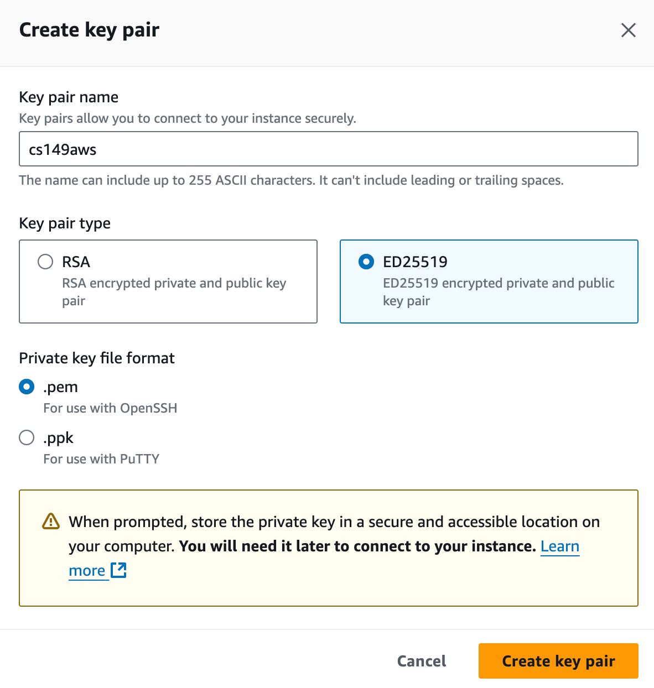
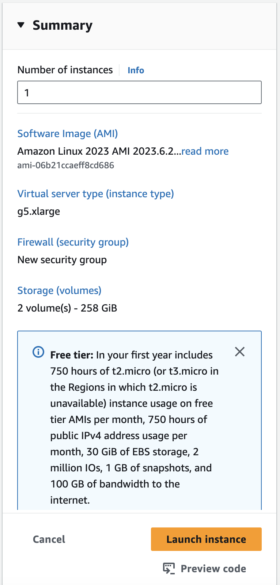

# AWS Setup Instructions #

For performance testing, you will need to run this assignment on a VM instance on Amazon Web Services (AWS). We'll be providing (or have already sent) you student coupons that you can use for billing purposes. Here are the steps for how to get setup for running on AWS.

> [!NOTE]
> Please don't forget to SHUT DOWN your instances when you're done for the day to avoid burning through credits overnight!

## Applying for Quota ##
The default AWS account level quota for GPU instances is 0, so many of you will not be able to actually launch a GPU instance unless you request an increase in your account-level quota. **Please follow the steps in [this document](https://docs.google.com/document/d/1NyiIvfKRCZG-ZLq4x1wukIdYg5FZoUZay_f1HSWUJ6I/edit?tab=t.0) to increase your account-level quota.** This process is fairly straightforward. After following the steps in the document, you will have submitted a quota increase ticket. You will be notified of this ticket creation by receiving an email to the email address associated with your AWS account. These tickets generally take several hours to process, and when they are approved you will receive an additional email to the email address that is associated with your AWS account. 

## Creating a VM ##

1. Log in to the [AWS EC2 dashboard](https://us-west-2.console.aws.amazon.com/ec2/home?region=us-west-2#Home). On the top right of the page, switch the the region to the one you have applied quota for.

2. Now you're ready to create a VM instance. Click on the button that says `Launch instance`.

3. Choose the `Ubuntu Server 24.04 LTS (HVM), SSD Volume Type` AMI:

4. Choose the `g5.xlarge` instance type.

5. Change the size of the volume to 64 GB to accomodate the packages we will need to install to make the instance functional for the assignment:

6. You will need a key pair to access your instance. In `Key pair (login)` section, click `Create a new key pair` and give it whatever name you'd like. This will download a keyfile to your computer called `<key_name>.pem` which you will use to login to the VM instance you are about to create. Finally, you can launch your instance.

7. Confirm all details and launch instance  

8. Now that you've created your VM, you should be able to __SSH__ into it. You need the public IPv4 DNS name to SSH into it, which you can find by navigating to your instance's page and then clicking the `Connect` button, followed by selecting the SSH tab (note, it may take a moment for the instance to startup and be assigned an IP address):

Make sure you follow the instructions to change the permissions of your key file by running `chmod 400 path/to/key_name.pem`.
Once you have the IP address, you can login to the instance by running this command:
~~~~
ssh -i path/to/key_name.pem ubuntu@<public_dns_name>
~~~~

> [!WARNING]
> If you need to step away during setup after creating your instance, be sure to shut it down. Leaving it running could deplete your credits, and you may incur additional costs.

## Setting up the VM environment ##

1. If you run `nvcc` in the instance and find it is not installed, you will need to run the install.sh script in the asst3 repo to reinstall CUDA 12. Likewise, if `nvidia-smi` shows a CUDA version that is 11.4, you also need to run install.sh. You may need to remove the existing nvidia driver first: `sudo apt remove --purge '^nvidia-.*'`. Clone the assignment repo to your instance using the following command.
~~~~
git clone https://github.com/stanford-cs149/asst3.git
~~~~

2. Add execute permissions, and run the installation script. If you encounter any issues, please make a post on Ed!
~~~~
chmod +x ./asst3/install.sh
./asst3/install.sh
~~~~

3. Restart the VM to boot the driver
~~~~
sudo reboot
~~~~

4. After running the script, CUDA should be installed. You can double check the cuda version using `nvidia-smi`, which should be **12.3**. The GPU we are using is **Tesla T4**. 

(If the command errors, try restarting the terminal/restarting the instance, and if error persists, make an Ed post and CAs will help!)
~~~~
lightsail-user@ip-172-26-12-153:~$ nvidia-smi
Mon Oct 23 16:08:43 2023       
+---------------------------------------------------------------------------------------+
| NVIDIA-SMI 545.23.06              Driver Version: 545.23.06    CUDA Version: 12.3     |
|-----------------------------------------+----------------------+----------------------+
| GPU  Name                 Persistence-M | Bus-Id        Disp.A | Volatile Uncorr. ECC |
| Fan  Temp   Perf          Pwr:Usage/Cap |         Memory-Usage | GPU-Util  Compute M. |
|                                         |                      |               MIG M. |
|=========================================+======================+======================|
|   0  Tesla T4                       On  | 00000000:00:1E.0 Off |                    0 |
| N/A   43C    P0              26W /  70W |    255MiB / 15360MiB |      0%      Default |
|                                         |                      |                  N/A |
+-----------------------------------------+----------------------+----------------------+
                                                                                         
+---------------------------------------------------------------------------------------+
| Processes:                                                                            |
|  GPU   GI   CI        PID   Type   Process name                            GPU Memory |
|        ID   ID                                                             Usage      |
|=======================================================================================|
|    0   N/A  N/A      2527      C   /usr/lib/x86_64-linux-gnu/dcv/dcvagent      249MiB |
+---------------------------------------------------------------------------------------+
~~~~

## Fetching your code from AWS ##

Once you've completed your assignment, you can download your code using the File Storage console by clicking on the double-arrow button at top left:

If you are using SSH, you can fetch your code using `scp` command like following in your local machine:
~~~~
scp -i <path-to-your-private-key> lightsail-user@<instance-IP-addr>:/path/to/file /path/to/local_file
~~~~

## Shutting down VM ##
When you're done using the VM, you can shut it down by clicking "stop computer" in the web page, or using the command below in the terminal.
~~~~
sudo shutdown -h now
~~~~