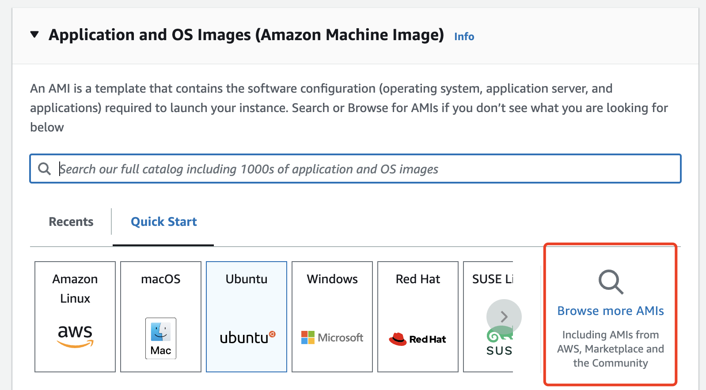
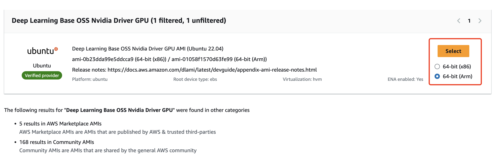
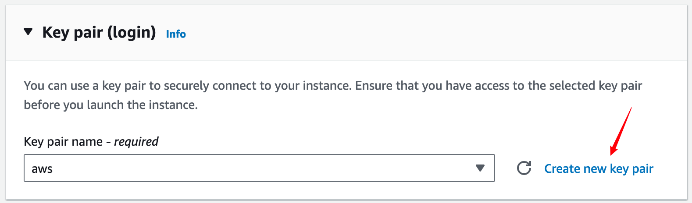
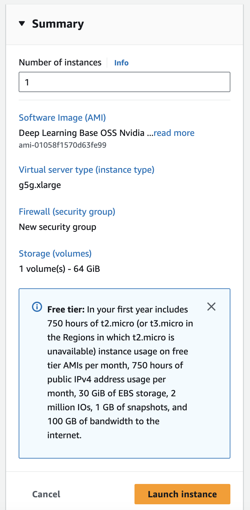

# AWS Setup Instructions #

For performance testing, you will need to run this assignment on a VM instance on Amazon Web Services (AWS). We'll be providing (or have already sent) you student coupons that you can use for billing purposes. Here are the steps for how to get setup for running on AWS.

> [!NOTE]
> Please don't forget to SHUT DOWN your instances when you're done for the day to avoid burning through credits overnight!

## Creating a VM ##

1. Log in to the [AWS EC2 dashboard](https://us-west-2.console.aws.amazon.com/ec2/home?region=us-west-2#Home). On the top right of the page, make sure you are on the `us-east-1` region.

2. Now you're ready to create a VM instance. Click on the button that says `Launch instance`.

3. Click on `Browse more AMIs` AMI.

4. Search for `Deep Learning Base OSS Nvidia Driver GPU` and make sure to select `64-bit (Arm)`.

4. Choose the `g5g.xlarge` instance type.

5. Change the size of the volume to 64 GB to accomodate the packages we will need to install to make the instance functional for the assignment:

6. You will need a key pair to access your instance. In `Key pair (login)` section, click `Create a new key pair` and give it whatever name you'd like. This will download a keyfile to your computer called `<key_name>.pem` which you will use to login to the VM instance you are about to create. Finally, you can launch your instance.

7. Confirm all details and launch instance  

8. Now that you've created your VM, you should be able to __SSH__ into it. You need the public IPv4 DNS name to SSH into it, which you can find by navigating to your instance's page and then clicking the `Connect` button, followed by selecting the SSH tab (note, it may take a moment for the instance to startup and be assigned an IP address):

Make sure you follow the instructions to change the permissions of your key file by running `chmod 400 path/to/key_name.pem`.
Once you have the IP address, you can login to the instance by running this command:
~~~~
ssh -i path/to/key_name.pem ubuntu@<public_dns_name>
~~~~

> [!WARNING]
> If you need to step away during setup after creating your instance, be sure to shut it down. Leaving it running could deplete your credits, and you may incur additional costs.

## Setting up the VM environment ##

1. CUDA should be by default installed. You can check the cuda version using `nvidia-smi` and see an output similar to the following. The CUDA version should be **12.4** and the GPU we are using is **NVIDIA T4G**.
~~~~
ubuntu@ip-172-31-32-141:~$ nvidia-smi
Thu Oct 24 21:34:13 2024       
+-----------------------------------------------------------------------------------------+
| NVIDIA-SMI 550.127.05             Driver Version: 550.127.05     CUDA Version: 12.4     |
|-----------------------------------------+------------------------+----------------------+
| GPU  Name                 Persistence-M | Bus-Id          Disp.A | Volatile Uncorr. ECC |
| Fan  Temp   Perf          Pwr:Usage/Cap |           Memory-Usage | GPU-Util  Compute M. |
|                                         |                        |               MIG M. |
|=========================================+========================+======================|
|   0  NVIDIA T4G                     On  |   00000000:00:1F.0 Off |                    0 |
| N/A   49C    P8             10W /   70W |       1MiB /  15360MiB |      0%      Default |
|                                         |                        |                  N/A |
+-----------------------------------------+------------------------+----------------------+
                                                                                         
+-----------------------------------------------------------------------------------------+
| Processes:                                                                              |
|  GPU   GI   CI        PID   Type   Process name                              GPU Memory |
|        ID   ID                                                               Usage      |
|=========================================================================================|
|  No running processes found                                                             |
+-----------------------------------------------------------------------------------------+
~~~~

2. Run the following command to install the FreeGlut library required for the assignment.
~~~~
sudo apt-get update && sudo apt-get install freeglut3-dev -y
~~~~

3. Now you can clone the asst3 git repository and start developing.
~~~~
git clone https://github.com/stanford-cs149/asst3.git
~~~~

## Fetching your code from AWS ##

We recommend that you create a private git repository and develop your assignment in there. It reduces the risk of losing your code and helps you keep track of old versions.

Alternatively, you can also use `scp` command like following in your local machine to fetch code from a remote machine.
~~~~
scp -i <path-to-your-private-key> lightsail-user@<instance-IP-addr>:/path/to/file /path/to/local_file
~~~~

## Shutting down VM ##
When you're done using the VM, you can shut it down by clicking "stop computer" in the web page, or using the command below in the terminal.
~~~~
sudo shutdown -h now
~~~~
